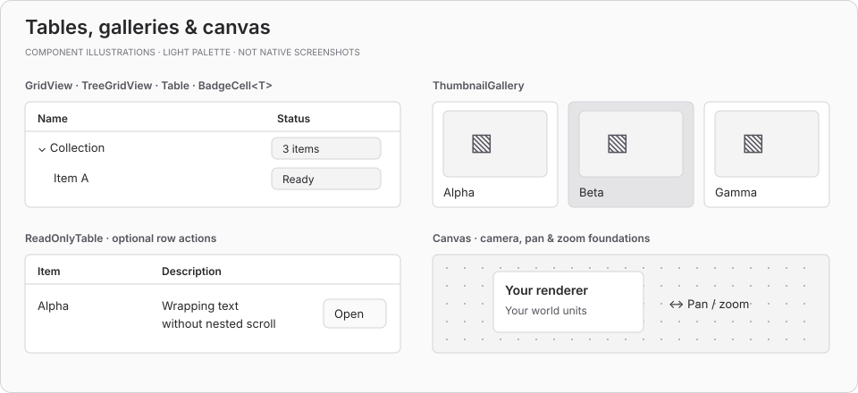
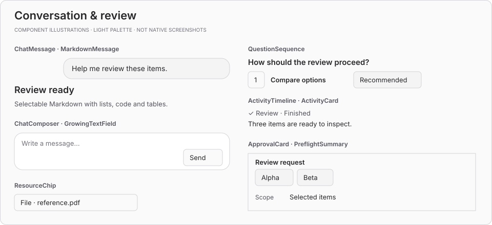

# Rhino Foundry UI

Preview.37 tightens activity timeline spacing and adds `FoundryAccordionItem(..., isActivity: true)` for muted, borderless activity disclosures.

Shared, theme-aware **Eto.Forms components for Rhino 8 / .NET 8** on Windows and macOS. Build forms, toolbars, data views and conversation surfaces from a common presentation layer.

**Prerelease: `0.3.0-preview.36`.** Native Windows sign-off is still required before a stable release. See [validation status](docs/VALIDATION.md) and the [changelog](CHANGELOG.md).

[Usage & examples](docs/USAGE.md) · [Component catalogue](#component-catalogue) · [Installation](#packages-and-installation) · [Contributing](docs/IMPLEMENTING_COMPONENTS.md)

## Component catalogue

The boards below are **schematic SVG illustrations, not native screenshots**. They show the available component families using a fixed light palette based on `FoundryTheme`. Actual fonts, colors, layout and native controls follow the Rhino host and platform. Sample text, images and canvas content belong to the consumer.

Each public control and composition helper is linked to its source below. For interactive native examples, see [Run the native gallery](#run-the-native-gallery).

### Actions & input

Buttons, text entry, field shells and value controls.


| Component | What it provides |
| --- | --- |
| [`FoundryDialogButton`](src/RhinoFoundry.UI/FoundryDialogButton.cs) | Secondary, primary, destructive and heading actions. |
| [`FoundryDialogActions`](src/RhinoFoundry.UI/FoundryDialogActions.cs) | Bind dialog Enter/Escape keys to accept/cancel actions. |
| [`FoundryFormField`](src/RhinoFoundry.UI/FoundryFormField.cs) | Standard field shell around an Eto control. |
| [`FoundryToolbarField`](src/RhinoFoundry.UI/FoundryToolbarField.cs) | Field shell sized for toolbar use. |
| [`FoundrySearchField`](src/RhinoFoundry.UI/FoundrySearchField.cs) | Search input with an integrated icon. |
| [`FoundryEditableTitle`](src/RhinoFoundry.UI/FoundryEditableTitle.cs) | Click to rename; keyboard commit and cancel. |
| [`FoundryGrowingTextField`](src/RhinoFoundry.UI/FoundryGrowingTextField.cs) | Text editor that grows to a bounded height. |
| [`FoundryCheckBox`](src/RhinoFoundry.UI/FoundryCheckBox.cs) | Boolean input with keyboard and focus behavior. |
| [`FoundryColorField`](src/RhinoFoundry.UI/FoundryColorField.cs) | Color value input using a native color dialog. |
| [`FoundrySlider`](src/RhinoFoundry.UI/FoundrySlider.cs) | Numeric range input with keyboard adjustment. |
| [`FoundrySurfaceButton`](src/RhinoFoundry.UI/FoundrySurfaceButton.cs) | Explicit 34px compatibility button. |
| [`FoundryInsetFormField`](src/RhinoFoundry.UI/FoundryInsetFormField.cs) | Explicit 34px compatibility field. |

### Choice & layout

Toolbars, selection controls and reusable panel compositions.


| Component | What it provides |
| --- | --- |
| [`FoundryToolbarIconButton`](src/RhinoFoundry.UI/FoundryToolbarIconButton.cs) | Icon action with tooltip, focus and selected state. |
| [`FoundryToolbarButtonGroup`](src/RhinoFoundry.UI/FoundryToolbarButtonGroup.cs) | Compose related toolbar buttons. |
| [`FoundryToolbarSeparator`](src/RhinoFoundry.UI/FoundryToolbarSeparator.cs) | Visual separator between toolbar actions. |
| [`FoundryViewModeSelector`](src/RhinoFoundry.UI/FoundryViewModeSelector.cs) | Table, thumbnail and canvas mode selection. |
| [`FoundryTextSegmentedControl`](src/RhinoFoundry.UI/FoundryTextSegmentedControl.cs) | Mutually exclusive text modes. |
| [`FilteredPicker`](src/RhinoFoundry.UI/FilteredPicker.cs) | Filtered single-choice picker. |
| [`FoundryMultiSelectField`](src/RhinoFoundry.UI/FoundryMultiSelectField.cs) | Multiple choices displayed as removable values. |
| [`FoundryRemovableBadge`](src/RhinoFoundry.UI/FoundryRemovableBadge.cs) | Compact value badge with optional removal. |
| [`FoundryAccordion`](src/RhinoFoundry.UI/FoundryAccordion.cs) | Compose expandable sections. |
| [`FoundryAccordionItem`](src/RhinoFoundry.UI/FoundryAccordion.cs) | Keep a section trigger and content synchronized. |
| [`FoundryAccordionTrigger`](src/RhinoFoundry.UI/FoundryAccordion.cs) | Expandable heading for custom compositions. |
| [`FoundryScrollable`](src/RhinoFoundry.UI/FoundryScrollable.cs) | Coalesced viewport-width synchronization for stable layout. |
| [`FoundryPaneResizeHandle`](src/RhinoFoundry.UI/FoundryPaneResizeHandle.cs) | Pointer and keyboard requests to resize a pane. |

### Tables, galleries & canvas

Data presentation and spatial foundations. Consumers supply the rows, images and rendering.



| Component | What it provides |
| --- | --- |
| [`FoundryGridView`](src/RhinoFoundry.UI/FoundryTables.cs) | Native flat grid presentation. |
| [`FoundryTreeGridView`](src/RhinoFoundry.UI/FoundryTables.cs) | Native hierarchical grid presentation. |
| [`FoundryTable`](src/RhinoFoundry.UI/FoundryTable.cs) | Shared native table styling and formatting helpers. |
| [`FoundryBadgeCell<T>`](src/RhinoFoundry.UI/FoundryBadgeCell.cs) | Custom-drawn badge cell for native tables. |
| [`FoundryReadOnlyTable`](src/RhinoFoundry.UI/FoundryReadOnlyTable.cs) | Content-height table with optional wrapping and asynchronous row actions. |
| [`FoundryThumbnailGallery`](src/RhinoFoundry.UI/FoundryThumbnailGallery.cs) | Responsive image cards, selection and optional drag data. |
| [`FoundryCanvas`](src/RhinoFoundry.UI/FoundryCanvas.cs) | Drawing surface with camera transforms and batched pan/zoom input. |

### Conversation & review

Compose conversations, questions and review surfaces with consumer-owned workflows.



| Component | What it provides |
| --- | --- |
| [`FoundryChatMessage`](src/RhinoFoundry.UI/FoundryChatMessage.cs) | User and assistant message presentation. |
| [`FoundryMarkdownMessage`](src/RhinoFoundry.UI/FoundryMarkdownMessage.cs) | Selectable, read-only Markdown, including tables. |
| [`FoundryChatComposer`](src/RhinoFoundry.UI/FoundryChatMessage.cs) | Growing editor with send, stop and optional leading action. |
| [`FoundryQuestionSequence`](src/RhinoFoundry.UI/FoundryQuestionSequence.cs) | Paged questions with descriptions, recommendations, custom answers and skipping. |
| [`FoundryActivityTimeline`](src/RhinoFoundry.UI/FoundryActivityTimeline.cs) | Chronological collection of activity rows. |
| [`FoundryActivityCard`](src/RhinoFoundry.UI/FoundryActivityTimeline.cs) | Action and state with optional detail and image inspection. |
| [`FoundryResourceChip`](src/RhinoFoundry.UI/FoundryResourceChip.cs) | Compact resource action with a consumer-supplied callback. |
| [`FoundryPreflightSummary`](src/RhinoFoundry.UI/FoundryPreflightSummary.cs) | Wrapping read-only badges and request facts. |
| [`FoundryApprovalCard`](src/RhinoFoundry.UI/FoundryApprovalCard.cs) | Titled review container for consumer-supplied content. |

### Themes, icons & platform foundations

These supporting APIs do not have a standalone visual surface.

| API | What it provides |
| --- | --- |
| [`FoundryTheme`](src/RhinoFoundry.UI/FoundryTheme.cs) | Semantic colors, typography, spacing, surfaces and hierarchy styling. |
| [`FoundrySurfaceTheme`](src/RhinoFoundry.UI/FoundrySurfaceTheme.cs) | Theme tokens for the explicit 34px compatibility family. |
| [`FoundryViewIcons`](src/RhinoFoundry.UI/FoundryViewIcons.cs) | Shared vector icons, including view modes, conversation, send, stop and camera. |
| [`FoundryMarkdownContent`](src/RhinoFoundry.UI/FoundryMarkdownMessage.cs) | Markdown-to-HTML conversion with raw HTML parsing disabled. |
| [`FoundryNative`](src/RhinoFoundry.UI/FoundryNative.cs) | Optional native service boundary for input, clipboard, tables and action popups. |
| [`FoundryMacOS`](src/RhinoFoundry.UI.MacOS/FoundryMacOS.cs) | AppKit adapter initialization for Mac consumers. |
| [`FoundryCamera`, `FoundryPoint`, `FoundrySize`, `FoundryRect`](src/RhinoFoundry.UI.Primitives/FoundryGeometry.cs) | Host-independent camera and geometry math. |
| [`FoundrySelectionModel<TKey>`](src/RhinoFoundry.UI.Primitives/FoundrySelectionModel.cs) | Generic selection state and range selection. |
| [`FoundryThumbnailGridLayout`, `FoundryThumbnailGridRect`](src/RhinoFoundry.UI.Primitives/ThumbnailGridLayout.cs) | Deterministic thumbnail placement. |
| [`FoundryCanvasGridPolicy`](src/RhinoFoundry.UI.Primitives/FoundryCanvasGridPolicy.cs) | Grid spacing and visibility policy. |

## Start composing

Create controls on Rhino's UI thread after platform initialization. A minimal form composition:

```csharp
using Eto.Forms;
using RhinoFoundry.UI;

var name = new TextBox { PlaceholderText = "Name" };
var include = new FoundryCheckBox("Include in review");
var review = new FoundryDialogButton("Review", FoundryDialogButtonStyle.Primary);
// Connect review.Click to your consumer-owned action.
var content = new StackLayout
{
    Spacing = FoundryTheme.Space2,
    Items = { new FoundryFormField(name), include, review }
};
```

The [consumer guide](docs/USAGE.md) covers package setup, platform initialization and copyable examples. The standard control family is 32 logical pixels high; `FoundrySurfaceButton` and `FoundryInsetFormField` preserve a separate 34px compatibility geometry.

This repository owns presentation and input behavior. Consumers own branding, values, validation, authorization, commands, Rhino document changes, persistence, preview generation, image lifetimes and application workflows. File pickers, color dialogs, context menus and message boxes stay native.

`FoundryMarkdownMessage` uses Markdig; consumers must deploy the transitive `Markdig.dll` dependency. It does not load remote resources, execute content scripts or navigate links.

## Packages and installation

| Package | Responsibility | Host dependency |
| --- | --- | --- |
| RhinoFoundry.UI.Primitives | Camera, geometry, thumbnail layout and generic selection | None |
| RhinoFoundry.UI | Theme, controls, accordion, resizable panes, gallery, tables, scroll container and canvas | Rhino-provided Eto / RhinoCommon |
| RhinoFoundry.UI.MacOS | AppKit trackpad, scoped clipboard and native table adapters | Installed Rhino Mac assemblies |

Pin all packages to the same exact version. Consumers vendor the prerelease `.nupkg` files in `packages/`, use that local NuGet source and commit `packages.lock.json`. Bundle the UI and Primitives DLLs beside every consumer RHP; include MacOS only in Mac bundles. This library is not installed as a separate Rhino plugin. Update all co-installed consumers together: Rhino can share assembly loads between plugins, so different DLLs with the same assembly version are unsafe.

Initialize `RhinoFoundry.UI.MacOS.FoundryMacOS.Initialize()` from each Mac consumer's composition boundary before controls load. Windows uses Eto input and native Windows controls; it must not reference or ship the Mac adapter. Never compile the Mac project using fallback stubs.

## Run the native gallery

Build [`RhinoFoundry.UI.HostChecks`](tools/RhinoFoundry.UI.HostChecks) and use [`samples/run-host-checks.py`](samples/run-host-checks.py) from Rhino's `RunPythonScript`. Set its `OUTPUT` path (or `FOUNDRY_UI_CHECK_OUTPUT`) to the matching DLL output directory. The script runs document-free contracts before opening `ComponentChecks.ShowGallery()` on Rhino's UI thread.

The current native gallery includes conversation controls, questions, editable titles, standard and 34px fields/buttons, checkbox, slider, accordion/scrolling and canvas examples. The catalogue above also documents controls not yet included in that native gallery. Check light/dark themes, keyboard behavior and display scaling in the actual host; illustrations and portable tests do not certify native behavior.

To regenerate the README illustrations:

```sh
python3 scripts/render-readme-gallery.py
```

The dependency-free generator writes the four SVGs in `docs/images/`. Update its illustrations when component presentation changes.

## Build and test

Use the SDK policy in `global.json` and a .NET 8 runtime. Portable checks:

```sh
dotnet restore src/RhinoFoundry.UI/RhinoFoundry.UI.csproj --locked-mode
dotnet build src/RhinoFoundry.UI/RhinoFoundry.UI.csproj --no-restore -c Release
dotnet test tests/RhinoFoundry.UI.Tests -c Release
dotnet test tests/RhinoFoundry.UI.Primitives.Tests -c Release
```

On a provisioned Mac, restore/build the solution and pack all three `src` projects. `RhinoMacResources` can point to the installed Rhino resources directory. Build to an isolated `BaseOutputPath` while Rhino is running. Do not use an ordinary hosted macOS CI runner as proof of native Rhino compatibility.

`tools/RhinoFoundry.UI.HostChecks` builds a document-free contract runner and visual gallery. Run its `ComponentChecks.Run()` and `ShowGallery()` inside Rhino's UI thread using the example in `samples/run-host-checks.py`. The ordinary xUnit tests do not initialize Eto or certify native behavior.

Packages remain local until explicit publication. Use `scripts/validate-packages.py` to verify payloads and generate a bundle hash manifest before syncing consumers. Rebuilds during development are staging candidates; once a version is distributed, publish changes under a new version.

## Documentation

- [Usage & examples](docs/USAGE.md) — consumer setup and component recipes.
- [Contracts](docs/CONTRACTS.md) — input, ownership and lifecycle rules.
- [Implementing components](docs/IMPLEMENTING_COMPONENTS.md) — contribution and migration requirements.
- [Validation](docs/VALIDATION.md) — platform checks and outstanding sign-off.
- [0.3 migration](docs/MIGRATION_0.3.md) — coordinated consumer changes.
- [Conversation surfaces](docs/CONVERSATION_SURFACES.md) — conversation presentation guidance.
- [Changelog](CHANGELOG.md) — release history and public API changes.

Preview.40 adds opt-in per-table selection colors and contrast-aware selected text. Existing callers retain native system selection colors.
